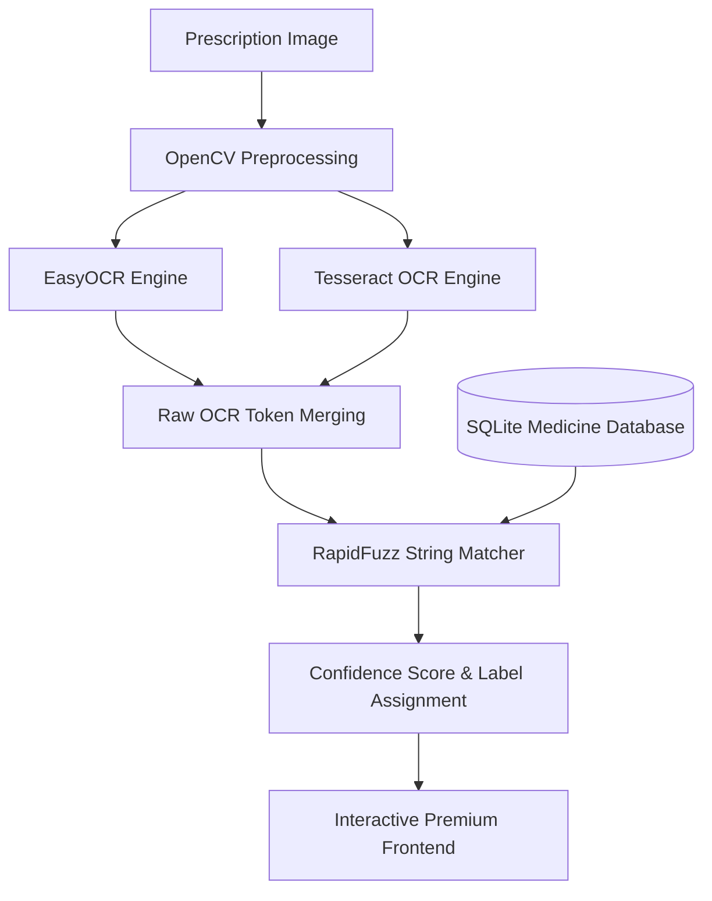

# 💊 RxVision AI: An AI-Assisted Prescription Reader and Medicine Identification System

[](https://fastapi.tiangolo.com/)
[](https://react.dev/)
[](https://vite.dev/)
[](https://www.python.org/)
[](https://sqlite.org/)

RxVision AI is a premium, AI-powered web-based utility designed to accurately identify medicine names from handwritten prescriptions. By combining a multi-engine OCR pipeline with fuzzy string matching against a verified database of 200+ common Indian medicines, RxVision AI serves as an intelligent second-opinion tool to mitigate prescription reading errors and improve patient safety.

---

## 📸 Project Interface Preview

The application features a cinematic, high-end dark user interface with glassmorphism effects, a looping background video, and micro-animations.

```
┌────────────────────────────────────────────────────────┐
│  💊 RxVision AI    Scan Prescription  Directory  Find  │
├────────────────────────────────────────────────────────┤
│                                                        │
│                     RxVision                           │
│     AI-powered prescription reader that decodes        │
│       handwritten prescriptions instantly              │
│                                                        │
│               [ Upload Prescription ]                  │
│                                                        │
├────────────────────────────────────────────────────────┤
│                  [ Drag & Drop Area ]                  │
│             (Tesseract + EasyOCR + Google)             │
└────────────────────────────────────────────────────────┘
```

---

## ⚡ Core Features

1. **Dual OCR Pipeline**: Processes handwriting using **EasyOCR** (deep learning-based handwriting detection) and printed text using **Tesseract OCR** to maximize extraction accuracy.
2. **OpenCV Preprocessing**: Applies computer vision techniques to enhance low-quality photos and optimize text readability for the OCR engines.
3. **Fuzzy String Matching**: Leverages the **RapidFuzz** library to map noisy OCR output onto clean database entries, tolerating minor spelling discrepancies and abbreviations.
4. **Verified Medicine Directory**: Browse 200+ common Indian medicines including generic composition, manufacturers, forms, and common aliases.
5. **Interactive Geolocation Finder**: Locate nearby pharmacies using Google Maps coordinates directly from the application interface.
6. **Continuous Correction Loop**: Allows users to log feedback/corrections to build a secondary database for model learning and adaptation.

---

## 🛠️ System Architecture



---

## 📁 Project Directory Structure

```
RxVision AI/
├── backend/                   # FastAPI backend server
│   ├── data/                  # SQLite DB & sample medicines data
│   ├── routers/               # API Router modules (upload, medicines, etc.)
│   ├── services/              # Logic services (OCR engines, mapping scripts)
│   ├── database.py            # SQLite setup and seed utilities
│   ├── main.py                # Server entry point
│   └── requirements.txt       # Python backend dependencies
│
└── frontend/                  # React & Vite frontend SPA
    ├── public/                # Static public assets
    ├── src/
    │   ├── assets/            # App graphics and media
    │   ├── components/        # Reusable React layout blocks & loaders
    │   ├── pages/             # View routers (Home, Directory, Pharmacy)
    │   ├── services/          # API Axios connections
    │   ├── App.jsx            # Route dispatcher & global layout
    │   ├── index.css          # Premium design system (vanilla CSS & custom properties)
    │   └── main.jsx           # App mounting point
    ├── index.html             # Page entry template
    └── package.json           # Frontend packages & scripts
```

---

## ⚙️ Installation & Local Setup

### 1. Prerequisites
Ensure you have the following installed on your system:
- **Python**: Version `3.10` or higher
- **Node.js**: Version `18.0` or higher (includes npm)
- **Tesseract OCR**: System executable installed and added to your environmental variables (`PATH`).

### 2. Backend Setup
1. Open a terminal and navigate to the backend directory:
   ```bash
   cd "backend"
   ```
2. Create and activate a Python virtual environment (optional but recommended):
   ```bash
   python -m venv venv
   # On Windows:
   venv\Scripts\activate
   # On macOS/Linux:
   source venv/bin/activate
   ```
3. Install the dependencies listed in `requirements.txt`:
   ```bash
   pip install -r requirements.txt
   ```
4. Start the FastAPI server using Uvicorn:
   ```bash
   python -m uvicorn main:app --reload --host 0.0.0.0 --port 8000
   ```
   *The API documentation is accessible at: `http://localhost:8000/docs`*

### 3. Frontend Setup
1. Open a separate terminal and navigate to the frontend directory:
   ```bash
   cd "frontend"
   ```
2. Install npm packages:
   ```bash
   npm install
   ```
3. Start the Vite dev server locally:
   ```bash
   npm run dev
   ```
   *Open your browser and navigate to: `http://localhost:5173`*

---

## 🌐 API Reference

| Endpoint | Method | Description |
| :--- | :--- | :--- |
| `GET /` | `GET` | API Health Check and endpoint map |
| `POST /api/upload` | `POST` | Upload prescription image to run through OCR & fuzzy search |
| `GET /api/medicines` | `GET` | Fetch entire seed directory of verified medicines |
| `GET /api/pharmacies` | `GET` | Fetch nearby pharmacies using coordinates |
| `POST /api/corrections`| `POST` | Submit corrected medicine name mapping feedback |

---

## ⚕️ Disclaimer

> [!WARNING]
> **Educational & Assistive Use Only**: RxVision AI is an educational tool and does **NOT** provide medical advice. It is strictly an assistive reference system designed to aid reading clarity. Always consult a licensed healthcare professional, physician, or pharmacist before consuming any medication. Result accuracy is dependent on image quality and OCR constraints.
